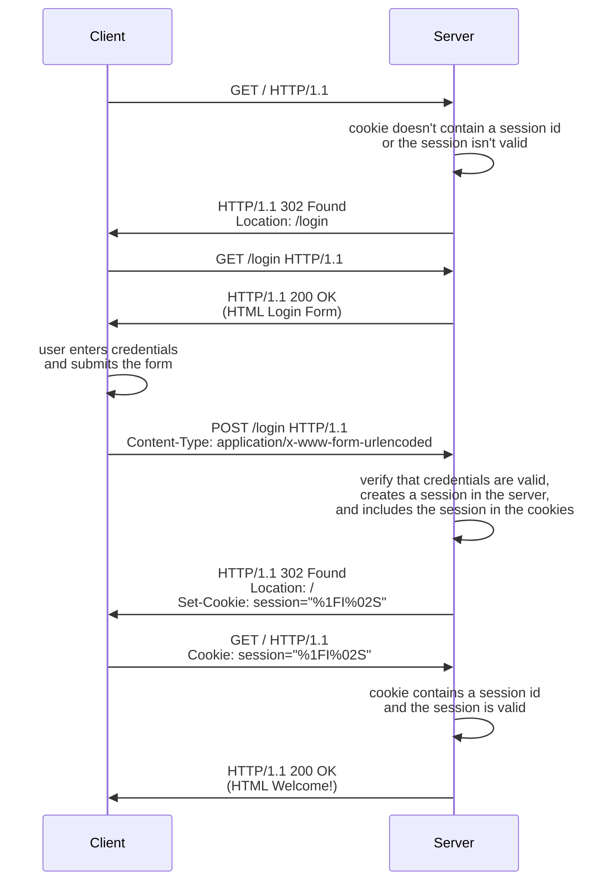

# Session Authentication[^1]

Session Based Authentication is an authentication strategy that uses sessions
and cookies to authenticate a client. At the back-end, the server creates and
stores a unique session identifier to each logged user, and at the front-end
the client stores this unique session identifier in a cookie and sends it with
each request. In this way, the server can recognize the client as a logged in
user, and the user doesn't need to send the credentials in each request.

In a nutshell, the typical flow of a Session Based Authentication strategy goes
like this: The client tries to access a restricted resource. The server checks
if the cookie includes a session identifier. If it does, it checks if the
session identifier is valid. If so, returns the resource. If not, the server
redirects the client to the login page. The user enters their credentials and
sends a post request to the appropriate URL. The server checks the credentials.
If the credentials are valid, it creates a session, and sets the cookie with
the session identifier. If the credentials are invalid, redirects to the login
page.

A typical flow goes something like this:



We need a few routes to handle this flow: a protected route `GET /`, that
always checks for a valid session the cookies, an unprotected route `GET
/login`, that is available to everyone, and a `POST /login` to process the
credentials.

The protected `GET /` route is processed as follows:

```javascript
fastify.get("/", async (request, reply) => {
  const session = request.cookies.session;
  const username = sessions.get(session);

  if (username) {
    reply.type("text/html").send(indexPage(username));
  } else {
    reply.clearCookie("sessionId").redirect("/login");
  }
});
```

The registered users are stored in the `users` global variable, and the active
sessions are stored in the `sessions` global variable. First, we try to
retrieve the session from the cookies, and we use the result to check if it's
among the active sessions.

If a session is successfully retrieved form the cookies, and it's a valid
session, we return the HTML resource. Otherwise, we redirect to the login
route.

The unprotected `GET /login` route is processed as follows:

```JavaScript
fastify.get("/login", async (request, reply) => {
  const session = request.cookies.session;

  if (session && sessions.has(session)) {
    reply.redirect("/");
  } else {
    reply.type("text/html").send(loginPage());
  }
});
```

We try to retrieve the session from the cookies, and check if it's among the
active sessions. If so, the user is already login, and we redirect to `/`.
Otherwise, we show the login form.

Finally, to process the login requests, we have the `POST /login` route:

```javascript
fastify.post("/login", async (request, reply) => {
  const { username, password } = request.body;

  if (users.get(username) === password) {
    const session = crypto.randomBytes(16).toString();
    sessions.set(session, username);
    reply.setCookie("session", session);
    reply.redirect("/");
  } else {
    reply.redirect("/login");
  }
});
```

First, we retrieve the username and password the user sent, and compare them
with the registered users and their passwords. If we find a match, we create a
new session, associate the user with the session, set the cookie with the
session, and redirect to `/`. Otherwise, we just redirect to the login page
again.

We can have a final route so users can log out:

```javascript
fastify.get("/logout", async (request, reply) => {
  const session = request.cookies.session;
  const username = sessions.get(session);

  if (session) {
    reply.clearCookie("session");
  }

  if (username) {
    sessions.delete(session);
  }

  reply.redirect("/");
});

```

It just clears the session cookie and removes the session from the list of
active sessions.

And that's Session Based Authentication!

[^1]: **Disclaimer:** The code presented above and in the source files doesn't
  follow the security best practices that would be necessary in a real world
  application. The purpose of the code is to be as simple as possible, so the
  focus can be on the logic relevant to demonstrate the Session Based
  Authentication strategy.
